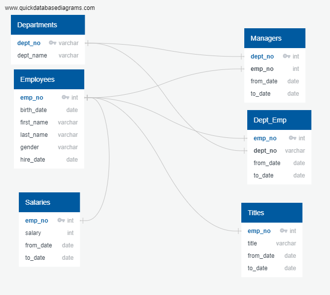
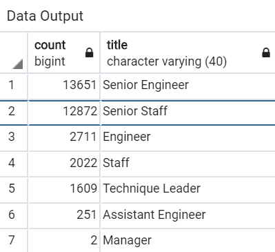

# Pewlett-Hackard-Analysis

## Module 7 Challenge

With concern for the large number of employees potentially retiring and with the current employee data residing in .csv files, it is very difficult to use this data for personnel retirement analysis. So the existing information was put into a database to allow for detailed analysis. Specifically, the goal of the project was to get a list of the Number of Retiring Employees by Title and develop a list of available mentors.  Another goal of this project in addition to providing useful information for Pwelett_Hackard was to learn about data modeling, engineering, and analysis. Specifically to goal was to learn:
  - How to design an ERD that will apply to the data
  - How to create and use a SQL database
  - To import and export large CSV datasets into pgAdmin
  - T0 practice using different joins to create new tables in pgAdmin.
  - To write basic- to intermediate-level SQL statements.

Six existing .cvs files (departments, dept_emp, dept_manager, employees, salaries, and titles) were used to create a database to allow for the detailed queries. First a map was made to show the tables in the database and the flow of data from one table to another. An Entity Relationship Diagram (ERD) was created to map out the database (see below):

There are three types of ERDs: conceptual, logical, and physical. Each one builds upon the other—you need the conceptual ERD to build a logical ERD to build a physical ERD. Next pgAdmin was used to create a Database. Although Postgres was used to hold the files, pgAdmin is where queries are written and executed and where results are viewed. Some trouble shooting was necessary when setting up the database and most troulbleshooting solutions were easily found by searching online. Once the database was set up, an intitial query was made to determine those elibible to retire, to determine Retirement Eligibility the following code was used:

	-- Retirement eligibility
	SELECT first_name, last_name
	FROM employees
	WHERE (birth_date BETWEEN '1952-01-01' AND '1955-12-31')
	AND (hire_date BETWEEN '1985-01-01' AND '1988-12-31');

The counting function of SQL was used to continue to refine the queries and a list of retirement-eligible employees were created and additional lists were provided for each department. Join functions were used to allow for the more sophisticated querries.  Three specific querries or lists were requested:
  - List 1: Employee Information
  	- Employee number
  	- First name, Last name
  	- Gender
  	- to_date
  	- Salary
  - List 2: Management, since many employees retiring are part of the management team, and these positions require training. This list includes:
	- manager’s employee number
	- first name, last name
	- starting and ending employment dates
  - List 3: Department Retirees to look at retirees by department. This list includes
	- emp_no
	- first_name
	- last_name
	- dept_name
After these lists were provided, the Module 7 Challenge required three deliverables:

Deliverable 1: Number of Retiring Employees by Title: 

The table is stored as retiring_titles. Building this table required the creation of three new tables, one showing number of [titles] retiring, one showing number of employees with each title, and one showing a list of current employees born between Jan. 1, 1952 and Dec. 31, 1955. New tables were exported as CSVs and are contained in the queries folder. This table contains the number of employees who are about to retire (those born 1952-1955), grouped by job title. Since some employees have switched titles over the years, duplicates had to be eliminated from the table. This was done by partitioning with the following code:

		-- Partition the data to show only most recent title per employee
		SELECT emp_no,
		first_name,
		last_name,
		title,
		from_date,
		salary
		INTO retirement_by_title_no_dups
		FROM (SELECT emp_no, first_name, last_name, title, from_date, salary,
		ROW_NUMBER() OVER
		(PARTITION BY emp_no ORDER BY from_date DESC) rn
	  		FROM retirement_by_title
	  		) tmp WHERE rn=1;

Deliverable 2: Mentorship Eligibility: 

There are 2,383 individuals identified a potential mentors.The table "mentorship" is also contained as mentorship.csv in the queries folder. To be eligible to participate in the mentorship program, employees needed to have a date of birth that falls between January 1, 1965 and December 31, 1965. Two inner joins were use to create a new table. 

Deliverable 3 - Analysis Report: A technical report which is this README.md file

The analysis results show that there are over 30,000 employees eligible to retire with over 25% of the eligible retirees from the Development Department and over 40% are senior Engineeers. The criteria evaluated for retirement eligibility were born from 1952 to 1955 with hire dates between 1985 and 1988. Over 2,000 eligible mentors were identified with birthdates in 1965. There are limitations in this analysis because the data originated from several .csv files with a limited number of columns. However, the database created is very powerful and can be used for additional queries to answer specific questions that come up moving forward.